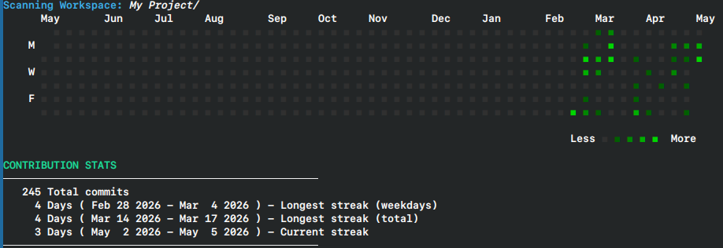

# git-cal

git-cal is a simple tool to view your Git contribution calendar directly in your terminal, similar to the contribution graph on a GitHub profile.




### Modern Features
This tool has been updated to work with legacy repositories and modern workspaces:
*   **Workspace Auto-Scan**: Point to a root folder, and the script will automatically find and aggregate data from all Git repositories inside it.
*   **Time Travel**: View contribution history from any year or period using the `--since` and `--anchor` options.
*   **Aggregate View**: Combine history from multiple repositories into a single calendar view.
*   **Cross-Platform**: Supports Linux, macOS, and Windows.

---

### Prerequisites & Installation

`git-cal` requires **Perl** and **Git**.

#### Linux
Perl is usually pre-installed on most Linux distributions.
```bash
# Ubuntu / Debian
sudo apt update && sudo apt install perl git

# Arch Linux
sudo pacman -S perl git

# Make git-cal executable
chmod +x git-cal
```

#### macOS
Perl and Git are available via macOS Command Line Tools or Homebrew:
```bash
# Optional: Install via Homebrew
brew install perl git

# Make git-cal executable
chmod +x git-cal
```

#### Windows
You have three options for running `git-cal` on Windows:

*   **Option 1: Git Bash (Recommended & Easiest)**
    If you have **Git for Windows** installed, open **Git Bash** in your project directory. `perl` is included automatically with Git Bash!
    ```bash
    ./git-cal
    # or
    perl git-cal
    ```

*   **Option 2: Windows PowerShell / CMD**
    If you run `perl git-cal` in PowerShell and see `'perl' is not recognized`, install **Strawberry Perl**:
    ```powershell
    # Via Winget in PowerShell
    winget install StrawberryPerl.StrawberryPerl
    ```
    *Or download the installer manually from [strawberryperl.com](https://strawberryperl.com/).*  
    After installation, restart PowerShell and run:
    ```powershell
    perl git-cal
    ```

*   **Option 3: WSL (Windows Subsystem for Linux)**
    Run directly inside your Linux distribution terminal on Windows:
    ```bash
    wsl ./git-cal
    ```

---

### Usage

#### 1. Basic Usage
Run inside any Git repository:
- **Linux / macOS / Git Bash:**
  ```bash
  ./git-cal
  ```
- **PowerShell / CMD:**
  ```powershell
  perl git-cal
  ```

#### 2. Scan an Entire Workspace
Point to a folder containing multiple Git projects to view aggregate activity:
```bash
# Linux / macOS / Git Bash
./git-cal "/path/to/your/projects/"

# Windows PowerShell / CMD
perl git-cal "C:\path\to\your\projects"
```

#### 3. View Past History (Time Travel)
View contributions from a specific past period (e.g. year 2015):
```bash
./git-cal --since="15 years" --anchor="2015-12-31"
```

#### 4. Filter by Author
```bash
./git-cal --author="Your Name"
```

---

### Credits and License
This tool is a modernized version of the original project created by:
*   **Original Author**: Karthik Katooru ([@k4rthik](https://github.com/k4rthik))
*   **License**: MIT License


